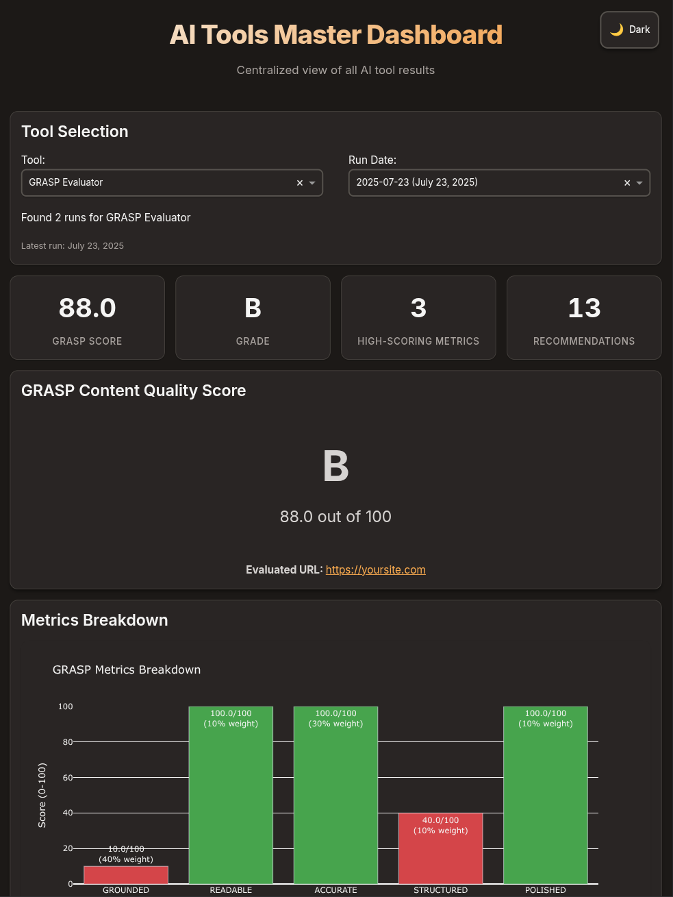

## Overview

GRASP Evaluator is a comprehensive assessment tool that evaluates website content quality across five weighted dimensions to optimize for LLM understanding and response generation.

<Frame>

</Frame>

<CardGroup cols={1}>
  <Card
    title="Grounded"
    icon="G"
    horizontal
    href="#grounded-evaluation"
  >
    Evaluates content alignment with customer intents using AI
  </Card>
  <Card
    title="Readability"
    icon="R"
    horizontal
    href="#readable-evaluation"
  >
    Analyzes reading level for target audience matching
  </Card>
  <Card
    title="Accuracy"
    icon="A"
    horizontal
    href="#accurate-evaluation"
  >
    Assesses content freshness as a way to determine accuracy
  </Card>
  <Card
    title="Structure"
    icon="S"
    horizontal
    href="#structured-evaluation"
  >
    Evaluates semantic HTML for optimal LLM consumption
  </Card>
  <Card
    title="Polish"
    icon="P"
    horizontal
    href="#polished-evaluation"
  >
    Evaluates content for grammar, spelling, and style
  </Card>
</CardGroup>


## Installation

<CodeGroup>

```bash Terminal
cd tools/graspevaluator
pip install -r requirements.txt
```

```bash One Command
pip install requests beautifulsoup4 lxml textstat openai python-dotenv pyyaml plotly
```

</CodeGroup>

## Configuration

Set up your OpenAI API key in the `.env` file:

```bash .env
OPENAI_API_KEY=your_openai_api_key_here
```

## Quick Start

<CodeGroup>

```bash Single URL
python graspevaluator.py --url https://example.com
```

```bash Batch Evaluation (Default)
python graspevaluator.py
```

```bash With Dashboard
python graspevaluator.py --dashboard
```

</CodeGroup>

## Configuration File

Customize evaluation parameters in `config/grasp_config.yaml`:

```yaml grasp_config.yaml
targets:
  - url: "https://yoursite.com"

grounded:
  intents:
    - "How do I contact support?"
    - "What are your pricing options?"
    - "How do I get started?"

readable:
  target_audience: "general_public"

accurate:
  freshness_thresholds:
    high: 180    # 6 months
    medium: 365  # 1 year

polished:
  use_llm: true
  llm_model: "gpt-3.5-turbo"
```

## Understanding Your Results

### GRASP Score Calculation

The overall GRASP score is calculated using weighted metrics:

<AccordionGroup>
  <Accordion title="Grounded (40% weight)">
    **Range**: 0-10 points
    
    - **9-10**: Content provides comprehensive answers to customer intents
    - **7-8**: Good content support with minor gaps
    - **5-6**: Partial information with noticeable gaps
    - **3-4**: Limited relevant information
    - **1-2**: Little to no relevant information
  </Accordion>

  <Accordion title="Readable (10% weight)">
    **Result**: Pass/Fail
    
    - **Pass**: Content reading level matches target audience (±1 grade level)
    - **Fail**: Content is too complex or too simple for target audience
    
    Target levels:
    - Elementary: Grades 3-6
    - High School: Grades 7-12
    - College: Grades 13-16
    - General Public: Grades 6-8
  </Accordion>

  <Accordion title="Accurate (30% weight)">
    **Ratings**: High/Medium/Low
    
    - **High**: Content updated within 6 months
    - **Medium**: Content updated within 1 year
    - **Low**: Content older than 1 year or no date found
    
    Date sources checked:
    - Meta tags
    - Schema.org markup
    - Time elements
    - Content patterns
    - HTTP headers
  </Accordion>

  <Accordion title="Structured (10% weight)">
    **Ratings**: Excellent/Good/Fair/Poor/Very Poor
    
    Evaluates:
    - Heading hierarchy (h1-h6)
    - Semantic HTML elements
    - Lists and tables
    - Schema.org markup
    - Open Graph tags
  </Accordion>

  <Accordion title="Polished (10% weight)">
    **Ratings**: Excellent/Good/Fair/Poor/Very Poor
    
    Checks:
    - Grammar and spelling errors
    - Punctuation issues
    - Style and readability
    - Error rate calculation
  </Accordion>
</AccordionGroup>

### Grade Scale

<Card>
  <CardGroup cols={2}>
    <Card title="A Grade" icon="trophy">
      90-100 points (Excellent)
    </Card>
    <Card title="B Grade" icon="medal">
      80-89 points (Good)
    </Card>
    <Card title="C Grade" icon="thumbs-up">
      70-79 points (Fair)
    </Card>
    <Card title="D Grade" icon="exclamation-triangle">
      60-69 points (Poor)
    </Card>
  </CardGroup>
</Card>

## Detailed Evaluations

### Grounded Evaluation

The grounded metric uses AI to evaluate content quality by:

1. **Intent Processing**: Takes customer intents from configuration
2. **Answer Generation**: Uses content to answer each intent
3. **Quality Assessment**: Evaluates answer completeness and accuracy
4. **Scoring**: Provides 0-10 score based on content support

<Tip>
Configure relevant customer intents in your `grasp_config.yaml` for the most accurate grounded evaluation.
</Tip>

### Readable Evaluation

Reading level assessment using multiple formulas:

- Flesch-Kincaid Grade Level
- Gunning Fog Index
- Coleman-Liau Index

The evaluator averages these scores and compares against your target audience.

### Accurate Evaluation

Since only the content creator can really know if the content is accurate, we use freshness as a proxy for accuracy. The idea is that if the content is updated regularly, it's far more likely to be accurate than stale content. We look at content freshness from multiple sources:

<Steps>
  <Step title="Meta Tags">
    `<meta name="last-modified">`, `<meta property="article:modified_time">`
  </Step>
  <Step title="Schema.org">
    `dateModified`, `datePublished` properties
  </Step>
  <Step title="Time Elements">
    `<time datetime="">` elements
  </Step>
  <Step title="Content Patterns">
    Date patterns in text content
  </Step>
  <Step title="HTTP Headers">
    `Last-Modified` header
  </Step>
</Steps>

### Structured Evaluation

HTML structure analysis covering:

- **Heading Hierarchy**: Proper h1-h6 usage and nesting
- **Semantic Elements**: main, article, section, header, footer, nav
- **Data Structures**: Lists, tables with proper markup
- **Schema Markup**: JSON-LD, microdata, RDFa
- **Meta Properties**: Open Graph, Twitter Cards

### Polished Evaluation

<Tabs>
  <Tab title="AI-Powered (Default)">
    Uses OpenAI API for comprehensive analysis:
    - Grammar checking
    - Spelling verification
    - Style assessment
    - Error rate calculation
  </Tab>
  <Tab title="Rule-Based (Fallback)">
    Built-in pattern matching for:
    - Common misspellings
    - Punctuation errors
    - Basic grammar mistakes
    - Style issues
  </Tab>
</Tabs>

## Dashboard Integration

GRASP evaluation results automatically integrate with the master dashboard:

<CardGroup cols={2}>
  <Card title="Score Visualization" icon="chart-bar">
    Interactive charts showing metric breakdown and trends
  </Card>
  <Card title="Detailed Analysis" icon="magnifying-glass">
    Comprehensive metric explanations and recommendations
  </Card>
  <Card title="Historical Tracking" icon="clock">
    Track improvements over time across evaluations
  </Card>
  <Card title="Recommendation Engine" icon="lightbulb">
    Actionable suggestions for content improvement
  </Card>
</CardGroup>

## Output Files

Results are saved in timestamped directories:

```
results/
└── 2024-01-15/
    ├── grasp_evaluation_results.json    # Detailed results
    ├── dashboard-data.json               # Dashboard format
    └── grasp_evaluator.log              # Execution log
```

## API Requirements

<Warning>
**OpenAI API Key Required** for Grounded and Polished metrics. The tool includes fallback methods but AI analysis provides the most accurate results.
</Warning>

**Rate Limits**: The evaluator respects API limits with:
- Built-in batching for intents
- Configurable request delays
- Automatic retry logic

## Troubleshooting

<AccordionGroup>
  <Accordion title="Missing API Key">
    ```
    Error: OPENAI_API_KEY not found in environment variables
    ```
    
    **Solution**: Add your API key to the `.env` file in the tools directory.
  </Accordion>

  <Accordion title="Rate Limiting">
    ```
    Error: Rate limit exceeded
    ```
    
    **Solutions**:
    - Reduce `batch_size` in configuration
    - Increase `retry_delay` in API settings
    - Use fewer customer intents
  </Accordion>

  <Accordion title="Content Too Long">
    ```
    Warning: Content truncated for analysis
    ```
    
    **Solution**: Increase `max_content_length` in grounded configuration.
  </Accordion>

  <Accordion title="No Date Found">
    ```
    Accurate metric: Low (No date found)
    ```
    
    **Solutions**:
    - Add `<meta name="last-modified">` tags
    - Include `<time>` elements with `datetime` attributes
    - Add schema.org `dateModified` properties
  </Accordion>
</AccordionGroup>

## Advanced Usage

### Custom Intents

Define specific customer intents for your business:

```yaml
grounded:
  intents:
    - "How do I integrate your API?"
    - "What are the pricing tiers?"
    - "How do I troubleshoot connection issues?"
    - "What security measures do you have?"
```

### Multiple Target Audiences

Configure different reading levels:

```yaml
readable:
  target_audience: "college"  # Options: elementary, high_school, college, graduate, general_public
```

### Custom Freshness Thresholds

Adjust based on your content update frequency:

```yaml
accurate:
  freshness_thresholds:
    high: 90     # 3 months for fast-moving content
    medium: 180  # 6 months
```

### Debug Mode

Run with verbose logging:

```bash
python graspevaluator.py --url https://example.com --verbose
```

## Best Practices

<CardGroup cols={2}>
  <Card title="Content Strategy" icon="strategy">
    - Align content with specific customer intents
    - Maintain appropriate reading level
    - Update content regularly
    - Use semantic HTML structure
  </Card>
  <Card title="Technical Implementation" icon="cog">
    - Add proper meta tags
    - Include schema.org markup
    - Use semantic HTML5 elements
    - Implement proper heading hierarchy
  </Card>
</CardGroup>

## Contributing

This tool is part of the Airbais suite. For contributions:

1. Follow existing code patterns
2. Add tests for new features
3. Update documentation
4. Ensure dashboard compatibility

<Card title="Support" icon="question-mark-circle">
For issues and questions, check the troubleshooting section or consult the technical documentation.
</Card>