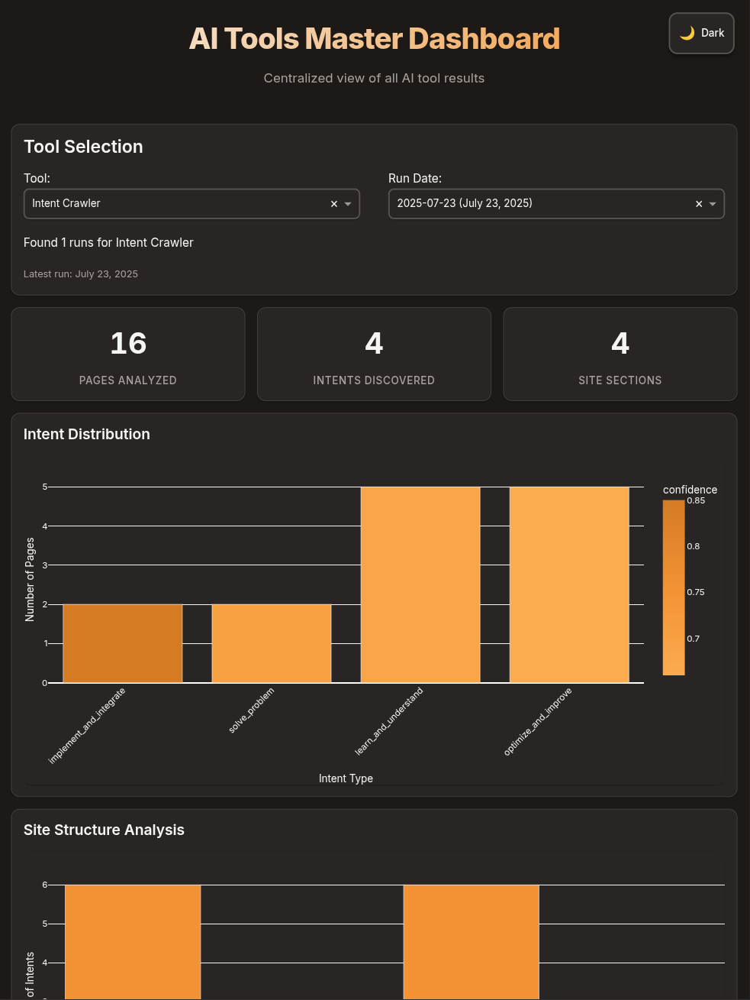

## Overview

Intent Crawler is a Python tool that crawls websites and interprets and analyzes the intents conveyed to LLMs and AI agents on your exisiting website. Part of the Airbais AI Tools Suite, Intent Crawler extracts content, discovers intents dynamically using multiple ML techniques, and provides results and recommendations on an interactive dashboard. This let's you review what your site is saying to AI and identify what needs adjusting.

<Frame>

</Frame>

## Key Features

<CardGroup cols={2}>
  <Card title="Intelligent Web Crawling" icon="spider-web">
    Respectful crawling with robots.txt compliance, automatic sitemap discovery, and configurable rate limiting
  </Card>
  <Card title="Advanced Intent Discovery" icon="brain">
    User-focused analysis (default), plus LDA topic modeling, sentence embeddings, and clustering
  </Card>
  <Card title="Modern Dashboard" icon="chart-line">
    A web dashboard with all the results from your evaluation. Suppors light/dark mode and responsive layout
  </Card>
  <Card title="Structured Exports" icon="file-export">
    Outputs in llmstxt format and JSON for in depth LLM evaluation
  </Card>
</CardGroup>

## Getting Started

### Installation

<Steps>
  <Step title="Clone the repository">
    ```bash
    git clone https://github.com/Airbais/intent-tools.git
    cd intentcrawler
    ```
  </Step>
  <Step title="Install dependencies">
    ```bash
    pip install -r requirements.txt
    python -m spacy download en_core_web_sm
    ```
  </Step>
  <Step title="Run your first analysis">
    ```bash
    python intentcrawler.py https://example.com --dashboard
    ```
  </Step>
</Steps>

### Quick Examples

<Tabs>
  <Tab title="Basic Usage">
    ```bash
    # Analyze a website
    python intentcrawler.py https://example.com
    ```
  </Tab>
  <Tab title="With Dashboard">
    ```bash
    # Analyze and view results in dashboard
    python intentcrawler.py https://example.com --dashboard
    ```
  </Tab>
  <Tab title="View Past Results">
    ```bash
    # View latest results (local dashboard)
    python intentcrawler.py --dashboard-only

    # View specific date
    python intentcrawler.py --dashboard-date 2024-06-26

    # Or use master dashboard (all tools)
    cd ../dashboard && python run_dashboard.py
    ```
  </Tab>
  <Tab title="List All Results">
    ```bash
    # See all available result dates
    python intentcrawler.py --list-results
    ```
  </Tab>
</Tabs>

## Configuration

Customize the tool's behavior through `config.yaml`:

<AccordionGroup>
  <Accordion icon="spider" title="Crawler Settings">
    Control how the tool crawls websites:
    
    ```yaml
    crawler:
      max_pages: 1000          # Maximum pages to crawl
      rate_limit: 2            # Seconds between requests
      respect_robots: true     # Follow robots.txt
      use_sitemap: true        # Auto-discover sitemaps
    ```
  </Accordion>
  
  <Accordion icon="magnifying-glass" title="Intent Extraction">
    Configure the ML-powered intent discovery:
    
    ```yaml
    intents:
      extraction_method: 'user_intent' # Default: user-focused analysis
      # Alternative: 'dynamic', 'enhanced', 'original'
      use_embeddings: true             # Sentence transformers
      use_lda: true                    # Topic modeling
      lda_topics: 10                   # Number of topics
      embeddings_model: 'sentence-transformers/all-MiniLM-L6-v2'
      fallback_keywords: true          # Keyword fallback
      similarity_threshold: 0.7        # Intent merging
      custom_keywords:                 # Domain-specific
        product_discovery: ['products', 'catalog', 'browse']
        support: ['help', 'support', 'faq']
        integration: ['api', 'developer', 'sdk']
    ```
  </Accordion>
  
  <Accordion icon="folder" title="Output Organization">
    Configure how results are stored:
    
    ```yaml
    output:
      base_directory: 'results'
      date_format: '%Y-%m-%d'
      keep_past_results: 7      # Days to keep (-1 for all)
      overwrite_today: true
    ```
  </Accordion>
</AccordionGroup>

## How It Works

### Intent Discovery Process

<Steps>
  <Step title="Content Extraction">
    Crawls website pages and extracts clean, structured content
  </Step>
  <Step title="Text Preprocessing">
    Removes noise, normalizes text, and prepares for analysis
  </Step>
  <Step title="Feature Extraction">
    - **TF-IDF**: Identifies important keywords
    - **Embeddings**: Captures semantic meaning
    - **N-grams**: Detects meaningful phrases
  </Step>
  <Step title="Intent Clustering">
    - **LDA**: Discovers latent topics
    - **DBSCAN**: Groups semantically similar content
    - **Keywords**: Matches known patterns
  </Step>
  <Step title="Intent Merging">
    Combines similar intents based on configurable similarity threshold
  </Step>
  <Step title="Naming & Scoring">
    Automatically generates descriptive intent names and confidence scores
  </Step>
</Steps>

### ML Techniques Explained

<CardGroup cols={3}>
  <Card title="LDA Topic Modeling" icon="layer-group">
    Discovers latent topics across all content with configurable topic counts
  </Card>
  <Card title="Embedding Clustering" icon="diagram-project">
    Uses sentence transformers and DBSCAN for semantic understanding
  </Card>
  <Card title="Keyword Fallback" icon="key">
    Configurable keywords ensure baseline intent detection
  </Card>
</CardGroup>

## Output Structure

Results are organized by date for easy historical tracking:

```
results/
├── 2024-06-26/              # Today's results
│   ├── llmstxt/
│   │   ├── llms.txt         # Main llmstxt file
│   │   └── pages/           # Individual page summaries
│   ├── intent-report.json   # Detailed intent analysis
│   ├── dashboard-data.json  # Dashboard visualization data
│   ├── intent-summary.md    # Human-readable summary
│   └── llm-export.json      # Structured for LLM tools
└── 2024-06-25/              # Yesterday's results
    └── ...
```

### Example Output

<CodeGroup>
```json Intent Discovery Result
{
  "discovered_intents": [
    {
      "primary_intent": "learn_integration",
      "confidence": 0.85,
      "keywords": ["api", "integration", "connect"],
      "representative_phrases": [
        "integrate with your application",
        "api documentation and guides"
      ],
      "page_count": 23,
      "extraction_method": "lda"
    }
  ]
}
```

```text llmstxt Format
# Example Company Documentation

Documentation for integrating with Example Company's platform.

## Topics

- API Integration (23 pages)
- Product Catalog (45 pages)
- User Guides (67 pages)
```
</CodeGroup>

## Dashboard Features

<Info>
  Two dashboard options: Local tool-specific dashboard and Master multi-tool dashboard
</Info>

### Modern Design System
<CardGroup cols={2}>
  <Card title="Airbais Design" icon="palette">
    Professional orange/gray color scheme with Inter font family
  </Card>
  <Card title="Light/Dark Mode" icon="moon">
    Toggle themes with persistent user preferences
  </Card>
  <Card title="Responsive Layout" icon="mobile">
    Works perfectly on desktop and mobile devices
  </Card>
  <Card title="Fast Performance" icon="bolt">
    Optimized loading and smooth interactions
  </Card>
</CardGroup>

<Tabs>
  <Tab title="Overview Stats">
    - **Total Pages**: Number of pages analyzed
    - **Discovered Intents**: Count of unique user intents
    - **Site Sections**: Structural breakdown of the website
    - **Confidence Indicators**: Visual quality scores
  </Tab>
  <Tab title="Interactive Charts">
    - **Intent Distribution**: Bar charts with confidence coloring
    - **Section Analysis**: Pie charts for each site section
    - **Site Structure**: Intent mapping across site hierarchy
    - **Drill-down Tables**: Detailed keyword and page breakdowns
  </Tab>
  <Tab title="Dashboard Options">
    - **Local Dashboard**: `python intentcrawler.py --dashboard-only`
    - **Master Dashboard**: `cd ../dashboard && python run_dashboard.py`
    - **Tool Selection**: Choose from multiple AI tools
    - **Date Selection**: Browse historical results
  </Tab>
  <Tab title="Export Features">
    - **JSON Export**: Machine-readable structured data
    - **Summary Reports**: Human-readable analysis
    - **llmstxt Format**: Ready for LLM consumption
    - **Master Integration**: Compatible with AI Tools Suite
  </Tab>
</Tabs>

## Command Line Reference

<ParamField path="url" type="string" required>
  The website URL to analyze
</ParamField>

<ParamField path="--config" type="string">
  Path to custom configuration file
</ParamField>

<ParamField path="--output" type="string">
  Override default output directory
</ParamField>

<ParamField path="--log-level" type="string">
  Set logging level: DEBUG, INFO, WARNING, ERROR
</ParamField>

<ParamField path="--dashboard" type="flag">
  Launch dashboard after analysis completes
</ParamField>

<ParamField path="--dashboard-only" type="flag">
  View existing results without running analysis
</ParamField>

<ParamField path="--dashboard-date" type="string">
  View results from specific date (YYYY-MM-DD)
</ParamField>

<ParamField path="--list-results" type="flag">
  List all available result dates
</ParamField>

## Performance Guidelines

<Warning>
  Processing time increases with site size and enabled ML features
</Warning>

<AccordionGroup>
  <Accordion icon="gauge-simple" title="Small Sites (<100 pages)">
    All features work well with default settings
  </Accordion>
  <Accordion icon="gauge" title="Medium Sites (100-500 pages)">
    Consider reducing LDA topics for faster processing
  </Accordion>
  <Accordion icon="gauge-high" title="Large Sites (500-1000 pages)">
    May need to disable embeddings or increase rate limiting
  </Accordion>
</AccordionGroup>

## Troubleshooting

<AccordionGroup>
  <Accordion icon="circle-exclamation" title="No intents discovered">
    - Check minimum cluster size in config
    - Ensure content has sufficient text
    - Try enabling fallback keywords
  </Accordion>
  <Accordion icon="clock" title="Slow processing">
    - Reduce number of LDA topics
    - Disable embedding extraction
    - Increase rate limit delay
  </Accordion>
  <Accordion icon="window-restore" title="Dashboard not loading">
    - Check if results exist in date folder
    - Verify dashboard-data.json is present
    - Check console for port conflicts
  </Accordion>
</AccordionGroup>

## Requirements

<Card title="System Requirements" icon="server">
  - Python 3.8+
  - See `requirements.txt` for full dependency list
  - Optional: GPU for faster embeddings processing
</Card>

## AI Tools Suite Integration

<Info>
  IntentCrawler is part of the larger Airbais AI Tools Suite with centralized dashboard
</Info>

<CardGroup cols={2}>
  <Card title="Master Dashboard" icon="dashboard">
    Centralized view of all AI tool results at `../dashboard/`
  </Card>
  <Card title="Auto-Discovery" icon="magnifying-glass">
    New tools are automatically detected and integrated
  </Card>
  <Card title="Standard Format" icon="file-code">
    JSON output compatible with other suite tools
  </Card>
  <Card title="Consistent Design" icon="palette">
    Shared Airbais design system across all tools
  </Card>
</CardGroup>

### Master Dashboard Benefits
- **Multi-Tool View**: See results from all AI tools in one interface
- **Tool Selection**: Dropdown to choose between different analysis tools
- **Date Selection**: Browse historical results across all tools
- **Future-Ready**: Architecture designed for easy tool addition

## Future Roadmap

<Steps>
  <Step title="Multi-language Support">
    Expand beyond English content analysis
  </Step>
  <Step title="Real-time Tracking">
    Monitor intent changes over time with the master dashboard
  </Step>
  <Step title="A/B Testing">
    Compare intents across different site versions
  </Step>
  <Step title="Suite Expansion">
    Add sentiment analysis, performance monitoring, and SEO tools
  </Step>
  <Step title="API Access">
    Programmatic access to all suite tools through unified API
  </Step>
</Steps>

## Contributing

We welcome contributions in these key areas:

<CardGroup cols={2}>
  <Card title="Algorithms" icon="code-branch">
    Additional clustering algorithms and ML techniques
  </Card>
  <Card title="Visualization" icon="chart-pie">
    Enhanced dashboard features and data visualization
  </Card>
  <Card title="Performance" icon="rocket">
    Optimization for large-scale websites
  </Card>
  <Card title="Integrations" icon="plug">
    CMS plugins and third-party tool connections
  </Card>
</CardGroup>
