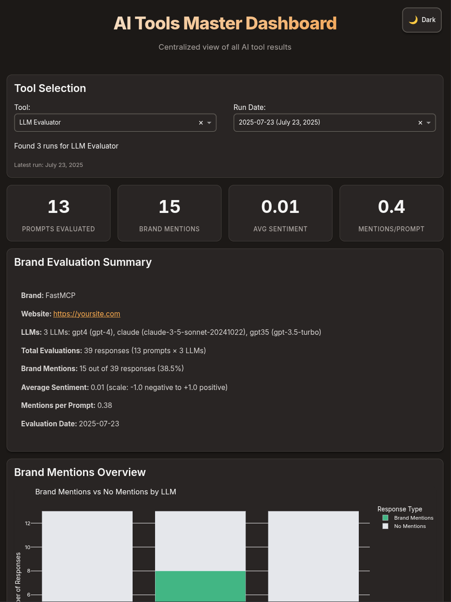

## Overview

A comprehensive tool to evaluate how brands are mentioned and represented in Large Language Model (LLM) responses based on user intents you specify. This will tell you if your brand pops in AI responses when it should.

<Frame>

</Frame>

## Key Features

<CardGroup cols={2}>
  <Card title="Multi-LLM Evaluation" icon="brain">
    Evaluate brand mentions across multiple LLMs simultaneously with comparative
    analysis
  </Card>
  <Card title="Sentiment Analysis" icon="chart-line">
    Hybrid sentiment analysis using TextBlob and LLM-based approaches for
    accurate brand perception
  </Card>
  <Card title="Context Detection" icon="magnifying-glass">
    Identifies whether mentions are recommendations, comparisons, examples, or
    explanations
  </Card>
  <Card title="Dashboard Integration" icon="chart-mixed">
    Automatically integrates with the master dashboard for visual analysis and
    reporting
  </Card>
</CardGroup>

## Getting Started

<Steps>
  <Step title="Clone the repository">
    ```bash
    git clone https://github.com/Airbais/intent-tools.git
    cd intentcrawler
    ```
  </Step>
  <Step title="Install Dependencies">
    Navigate to the llmevaluator directory and install required packages:

    ```bash
    cd llmevaluator
    pip install -r requirements.txt
    ```
  </Step>
  <Step title="Configure Environment">
    Set up your API keys and environment variables:

    ```bash
    cp .env.example .env
    # Edit .env with your API keys
    ```

    <Info>
      You'll need API keys for OpenAI and/or Anthropic depending on which LLMs
      you want to evaluate.
    </Info>
  </Step>
  <Step title="Create Configuration">
    Create a markdown configuration file with your brand information and
    evaluation prompts:

    ```markdown
    # Brand Configuration
    ## Brand Information
    - **Name**: YourBrand
    - **Website**: https://yourbrand.com
    - **Aliases**: ["Your Brand", "YB"]
    - **Competitors**: ["Competitor A", "Competitor B"]
    ## LLMs
    - name: gpt4
      provider: openai
      model: gpt-4
      temperature: 0.7
      max_tokens: 300
    - name: claude
      provider: anthropic
      model: claude-3-sonnet-20240229
      temperature: 0.5
      max_tokens: 300
    ```
  </Step>
  <Step title="Run Evaluation">
    Execute the evaluation with dashboard integration:

    ```bash
    python llmevaluator.py config.md --dashboard
    ```
  </Step>
</Steps>

## Configuration

<AccordionGroup>
  <Accordion title="Brand Information Setup">
    Configure your brand details for accurate detection and analysis:

    ```markdown
    ## Brand Information
    - **Name**: FastMCP
    - **Website**: https://gofastmcp.com
    - **Aliases**: ["Fast MCP", "FastMCP Protocol"]
    - **Competitors**: ["SlowMCP", "StandardMCP"]
    ```

    - **Name**: Primary brand name to track
    - **Website**: Official website URL for reference tracking
    - **Aliases**: Alternative names or spellings of your brand
    - **Competitors**: Competitor brands to track for comparison
  </Accordion>
  <Accordion title="Multi-LLM Configuration">
    Configure multiple LLMs for comparative analysis:

    ```markdown
    ## LLMs
    - name: gpt4
      provider: openai
      model: gpt-4
      temperature: 0.7
      max_tokens: 300
    - name: claude
      provider: anthropic
      model: claude-3-sonnet-20240229
      temperature: 0.5
      max_tokens: 300
    - name: gpt35
      provider: openai
      model: gpt-3.5-turbo
      temperature: 0.7
      max_tokens: 300
    ```

    Each LLM configuration includes:

    - **name**: Unique identifier for the LLM
    - **provider**: openai or anthropic
    - **model**: Specific model name
    - **temperature**: Response randomness (0-1)
    - **max_tokens**: Maximum response length
  </Accordion>
  <Accordion title="Evaluation Prompts">
    Design prompts that naturally elicit brand mentions:

    ```markdown
    ## Evaluation Prompts
    ### Category: Getting Started
    1. How would I create a [domain] server?
    2. What is the fastest way to create an [domain] server?
    3. What are some frameworks I can use to create [domain] servers and clients?
    
    ### Category: Development
    1. How would I create an [domain] client?
    2. What clients support integration of my [domain] tools?
    3. How do I integrate [domain] tools with existing applications?
    
    ### Category: Best Practices
    1. How should I manage security in my [domain] tool?
    2. What are the best practices for [domain] server development?
    3. How do I ensure my [domain] tools are performant and scalable?
    ```

    <Warning>
      Use `[domain]` placeholders that will naturally lead to mentions of your
      brand or product category.
    </Warning>
  </Accordion>
  <Accordion title="Evaluation Settings">
    Fine-tune evaluation behavior and caching:

    ```markdown
    ## Evaluation Settings
    - **Cache Responses**: true
    - **Sentiment Analysis Method**: hybrid
    - **Cache Expire Hours**: 24
    - **Batch Size**: 10
    ```

    - **Cache Responses**: Enable response caching to reduce API costs
    - **Sentiment Analysis Method**: "hybrid" combines TextBlob and LLM analysis
    - **Cache Expire Hours**: How long to keep cached responses
    - **Batch Size**: Number of prompts to process simultaneously
  </Accordion>
</AccordionGroup>

## How It Works

<Steps>
  <Step title="Configuration Loading">
    The tool parses your markdown configuration file to extract brand
    information, LLM settings, and evaluation prompts.
  </Step>
  <Step title="Multi-LLM Prompt Execution">
    Each prompt is sent to all configured LLMs simultaneously, with responses
    cached to optimize API usage and costs.
  </Step>
  <Step title="Brand Mention Detection">
    Responses are analyzed to detect mentions of your brand, aliases, and
    competitors using pattern matching and context analysis.
  </Step>
  <Step title="Sentiment Analysis">
    Each mention is analyzed for sentiment using a hybrid approach combining
    TextBlob and LLM-based sentiment analysis for accuracy.
  </Step>
  <Step title="Context Classification">
    Mentions are classified by context (recommendation, comparison, example,
    explanation) and position within the response.
  </Step>
  <Step title="Comparative Metrics">
    When multiple LLMs are used, additional metrics are calculated including
    consensus scores and sentiment alignment between LLMs.
  </Step>
  <Step title="Report Generation">
    Comprehensive reports are generated with per-LLM metrics, comparative
    analysis, and dashboard-compatible data structures.
  </Step>
</Steps>

## Output Structure

Results are organized in timestamped directories for easy tracking and comparison:

```
results/
└── 2024-01-15/
    ├── dashboard-data.json    # Dashboard-compatible data with multi-LLM structure
    ├── raw_results.json       # Detailed evaluation results for all LLMs
    ├── metrics_summary.json   # Aggregate metrics across all LLMs
    └── evaluation_report.txt  # Human-readable report with comparative analysis
```

<Tabs>
  <Tab title="Dashboard Data">
    The `dashboard-data.json` file contains structured data optimized for the master dashboard:

    ```json
    {
      "metadata": {
        "timestamp": "2025-07-05T07:43:12.089714",
        "llms": [
          {
            "name": "gpt4",
            "provider": "openai",
            "model": "gpt-4"
          },
          {
            "name": "claude",
            "provider": "anthropic",
            "model": "claude-3-sonnet-20240229"
          }
        ],
        "prompt_count": 13,
        "brand": "FastMCP"
      },
      "llm_metrics": {
        "gpt4": {
          "total_prompts": 13,
          "total_brand_mentions": 7,
          "average_sentiment": 0.0,
          "mention_rate": 0.54
        },
        "claude": {
          "total_prompts": 13,
          "total_brand_mentions": 8,
          "average_sentiment": 0.7,
          "mention_rate": 0.62
        }
      }
    }
    ```
  </Tab>
  <Tab title="Metrics Summary">
    Aggregate metrics across all LLMs:

    ```json
    {
      "aggregate_metrics": {
        "total_prompts": 13,
        "total_brand_mentions": 22,
        "average_sentiment": 0.7,
        "mention_rate": 0.56
      },
      "comparative_metrics": {
        "consensus_score": 1.0,
        "sentiment_alignment": 0.596,
        "mention_rate_variance": 0.0
      }
    }
    ```
  </Tab>
  <Tab title="Detailed Results">
    Complete evaluation data with individual prompt responses:

    ```json
    {
      "detailed_results": [
        {
          "prompt": "How would I create a FastMCP server?",
          "category": "Getting Started",
          "responses": {
            "gpt4": {
              "response": "Creating a FastMCP server requires...",
              "analysis": {
                "brand_mentions": 7,
                "sentiment_score": 0.0,
                "sentiment_label": "neutral",
                "mention_positions": ["first_paragraph", "middle"]
              }
            }
          }
        }
      ]
    }
    ```
  </Tab>
</Tabs>

## Dashboard Features

The evaluation results automatically integrate with the master dashboard, providing:

<CardGroup cols={2}>
  <Card title="Multi-LLM Comparison" icon="chart-bar">
    Side-by-side comparison of how different LLMs mention and represent your
    brand
  </Card>
  <Card title="Sentiment Analysis" icon="face-smile">
    Visual sentiment distribution with context and position tracking
  </Card>
  <Card title="Comparative Metrics" icon="scale-balanced">
    Consensus scores, sentiment alignment, and mention rate variance between
    LLMs
  </Card>
  <Card title="Category Performance" icon="tags">
    Performance breakdown by prompt categories (Getting Started, Development,
    etc.)
  </Card>
</CardGroup>

## Command Line Reference

<ParamField path="config_file" type="string" required>
  Path to the markdown configuration file containing brand information and
  evaluation prompts
</ParamField>

<ParamField path="--dashboard" type="flag">
  Launch the dashboard after evaluation completes
</ParamField>

<ParamField path="--dashboard-only" type="flag">
  Launch dashboard without running evaluation (view existing results)
</ParamField>

<ParamField path="--dashboard-date" type="string">
  Launch dashboard for specific result date (format: YYYY-MM-DD)
</ParamField>

<ParamField path="--output-dir" type="string">
  Custom output directory for results (default: ./results)
</ParamField>

<ParamField path="--no-cache" type="flag">
  Disable response caching for this evaluation run
</ParamField>

<ParamField path="--clear-cache" type="flag">
  Clear existing cache before running evaluation
</ParamField>

<ParamField path="--dry-run" type="flag">
  Validate configuration without executing prompts
</ParamField>

<ParamField path="--list-results" type="flag">
  Show all available result dates
</ParamField>

<ParamField path="--log-level" type="string">
  Set logging level (DEBUG, INFO, WARNING, ERROR)
</ParamField>

## Usage Examples

<CodeGroup>

```bash Basic Evaluation
# Run evaluation with configuration file
python llmevaluator.py config.md

# With dashboard launch
python llmevaluator.py config.md --dashboard
```


```bash Advanced Options
# Custom output directory with debug logging
python llmevaluator.py config.md --output-dir ./custom-results --log-level DEBUG

# Clear cache and run without caching
python llmevaluator.py config.md --clear-cache --no-cache

# Validate configuration only
python llmevaluator.py config.md --dry-run
```


```bash Dashboard Management
# View existing results
python llmevaluator.py --dashboard-only

# View specific date results
python llmevaluator.py --dashboard-date 2024-01-15

# List all available results
python llmevaluator.py --list-results
```

</CodeGroup>

## Metrics Explained

### Brand Mention Metrics

- **Total Mentions**: Count of brand name appearances across all responses
- **Mention Rate**: Average mentions per prompt (mentions ÷ prompts)
- **Position Distribution**: Where mentions appear (beginning, middle, end of responses)
- **Context Types**: How the brand is mentioned (recommendation, comparison, example, explanation)

### Sentiment Analysis

- **Score Range**: -1.0 (negative) to \+1.0 (positive)
- **Labels**: Positive, Negative, Neutral, or Not Mentioned
- **Method**: Hybrid approach combining TextBlob and LLM-based sentiment analysis for improved accuracy

### Multi-LLM Comparative Metrics

When evaluating multiple LLMs, additional insights are generated:

<CardGroup cols={3}>
  <Card title="Consensus Score" icon="handshake">
    Percentage of prompts where all LLMs agree on mentioning (or not mentioning)
    the brand
  </Card>
  <Card title="Sentiment Alignment" icon="heart-handshake">
    How closely LLMs agree on brand sentiment (0-100% agreement)
  </Card>
  <Card title="Mention Rate Variance" icon="chart-line-up">
    Statistical variance in mention rates across different LLMs
  </Card>
</CardGroup>

## Performance Guidelines

<Warning>
  Multi-LLM evaluations can be expensive. Consider these optimization
  strategies:
</Warning>

- **Enable Caching**: Set `Cache Responses: true` to reuse responses and reduce API costs
- **Batch Processing**: Use reasonable batch sizes (5-10 prompts) to optimize throughput
- **Targeted Prompts**: Design prompts that naturally elicit brand mentions in your domain
- **Cache Management**: Use `--clear-cache` only when necessary to avoid unnecessary API calls

<Info>
  A typical evaluation with 13 prompts across 3 LLMs results in 39 API calls.
  With caching enabled, subsequent runs with the same prompts cost nothing.
</Info>

## Troubleshooting

<AccordionGroup>
  <Accordion title="API Key Configuration">
    **Problem**: "No API key found" errors
    **Solution**: Ensure your `.env` file contains valid API keys:

    ```env
    OPENAI_API_KEY=your_openai_key_here
    ANTHROPIC_API_KEY=your_anthropic_key_here
    ```

    Check that the environment variables are properly loaded by running:

    ```bash
    python -c "import os; print('OpenAI:', bool(os.getenv('OPENAI_API_KEY'))); print('Anthropic:', bool(os.getenv('ANTHROPIC_API_KEY')))"
    ```
  </Accordion>
  <Accordion title="Rate Limiting Issues">
    **Problem**: API rate limit errors or timeouts
    **Solution**: The tool implements automatic retries with exponential backoff. For persistent issues:

    - Reduce batch size in your configuration
    - Add delays between requests
    - Check your API tier limits with your provider
    - Use caching to minimize repeat requests
  </Accordion>
  <Accordion title="Cache Problems">
    **Problem**: Stale or incorrect cached results

    **Solution**: Clear the cache and run fresh evaluation:

    ```bash
    python llmevaluator.py config.md --clear-cache
    ```

    You can also manually delete the cache directory:

    ```bash
    rm -rf ./cache
    ```
  </Accordion>
  <Accordion title="Dashboard Integration">
    **Problem**: Results not appearing in dashboard

    **Solution**: Ensure the evaluation completed successfully and check:

    - Results directory contains `dashboard-data.json`
    - Master dashboard is running from the correct tools directory
    - No JSON formatting errors in the results file
  </Accordion>
</AccordionGroup>

## Requirements

### System Requirements

- **Python**: 3.8 or higher
- **Memory**: 512MB RAM minimum
- **Storage**: 100MB for cache and results
- **Network**: Internet connection for API access

### API Requirements

- **OpenAI API Key**: For GPT models (gpt-4, gpt-3.5-turbo)
- **Anthropic API Key**: For Claude models (claude-3-opus, claude-3-sonnet)

### Dependencies

Key Python packages (automatically installed):

- `openai` - OpenAI API client
- `anthropic` - Anthropic API client
- `textblob` - Sentiment analysis
- `diskcache` - Response caching
- `tqdm` - Progress tracking
- `pandas` - Data processing
- `plotly` - Dashboard visualization

## Integration

LLM Evaluator is designed to work seamlessly with the broader AI Tools Suite:

- **Master Dashboard**: Automatic integration with shared visualization platform
- **Intent Crawler**: Compare brand mentions against discovered user intents
- **Shared Infrastructure**: Common caching, logging, and configuration patterns
- **Cross-Tool Analysis**: Combine insights from multiple evaluation tools

## Advanced Usage

### Programmatic Integration

```python
from src.config import ConfigurationManager
from src.llm_interface import LLMInterface
from src.prompt_executor import PromptExecutor
from src.analyzer import ResponseAnalyzer

# Load configuration
config_manager = ConfigurationManager('config.md')
settings = config_manager.get_evaluation_settings()
brand_info = config_manager.get_brand_info()
prompts = config_manager.get_prompts()

# Initialize components
llm_interface = LLMInterface.create_from_config(settings)
executor = PromptExecutor(llm_interface)
analyzer = ResponseAnalyzer(brand_info, settings)

# Execute evaluation
results = executor.execute_batch(prompts, settings)
metrics = analyzer.analyze_multi_llm_results(results)

print(f"Brand mentioned in {metrics.mention_rate:.1%} of responses")
print(f"Average sentiment: {metrics.average_sentiment:.2f}")
```

### Custom Sentiment Analysis

```python
# Override sentiment analysis method
settings.sentiment_analysis_method = "llm_only"  # or "textblob_only"

# Custom sentiment prompts
settings.sentiment_prompt_template = """
Analyze the sentiment toward {brand_name} in this text: {response_text}
Rate from -1 (very negative) to +1 (very positive): 
"""
```

## Contributing

When contributing to LLM Evaluator:

1. **Maintain Dashboard Compatibility**: Ensure changes don't break dashboard integration
2. **Follow Multi-LLM Patterns**: New features should support multiple LLM evaluation
3. **Add Comprehensive Logging**: Use the existing logging framework for debugging
4. **Update Documentation**: Keep this MDX file current with new features
5. **Test with Real APIs**: Validate changes with actual LLM providers
6. **Consider Costs**: Be mindful of API usage in new features

## Future Roadmap

- **Additional LLM Providers**: Support for Cohere, AI21, and other providers
- **Advanced Analytics**: Statistical significance testing for comparative metrics
- **Real-time Monitoring**: Continuous brand mention tracking across time
- **Custom Scoring Models**: User-defined sentiment and relevance scoring
- **Export Capabilities**: PDF reports and data export formats
- **A/B Testing Framework**: Compare different prompt strategies

---

Part of the **Airbais AI Tools Suite** - Comprehensive tools for AI-powered business intelligence and brand analysis.